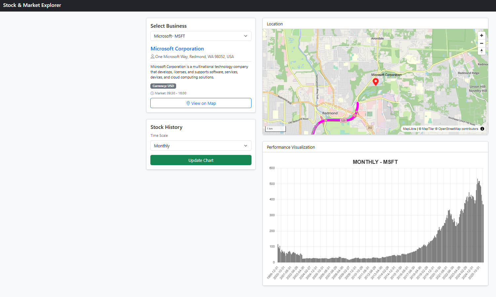

# Stock & Market Explorer

L'applicazione _Stock & Market Explorer_ permette di visionare i risultati finanziari (ottenuti tramite l'_Application Programming Interface_ di AlphaVantage) di aziende quotate in borsa.

Nella colonna di sinistra (su desktop, che su mobile diventa incolonnato in verticale) è possibile selezionare una azienda e visualizzarne sommarie informazioni. Compiuta tale operazione si può optare per far comparire la sede principale sulla mappa ("View on Map") e/o visualizzarne le quotazioni in ambito giornaliero, settimanale o mensile.